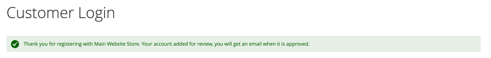
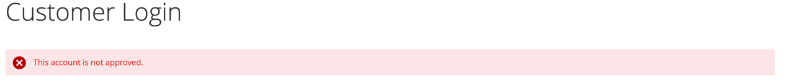
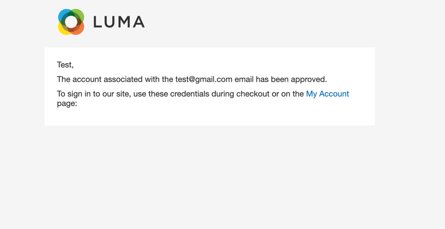
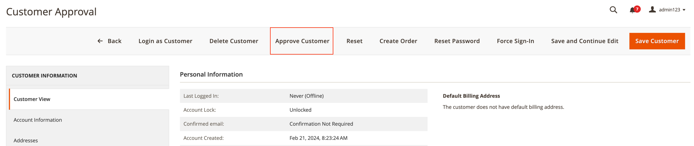
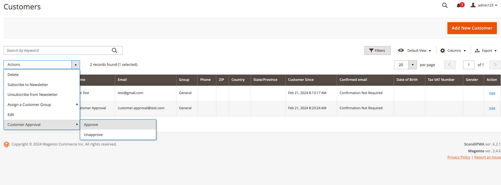
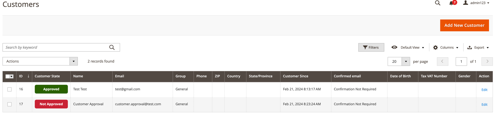
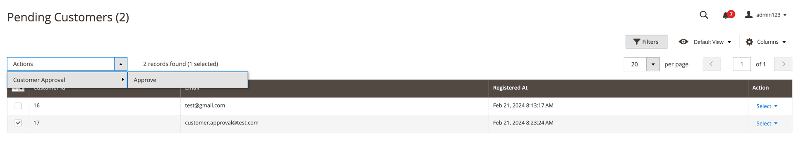
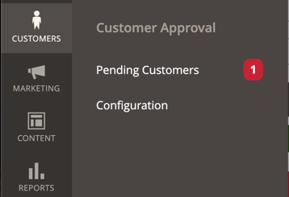
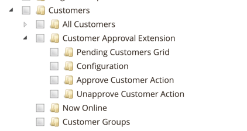

# Magento 2 Customer Approval Extension

## Requirements
* Magento 2.0.0-2.4.x

## Overview
Let your customers access the website only after your approval.

## Main Features
* Custom customer account creation success message
* Custom login attempt error message
* Email notification for the customer when the account is approved
* Rich configuration
* Additional pending customer's custom listing with mass actions
* Customer approval state can be seen on the customer listing page
* Mass actions for customer listing
* Pending customers badge in Admin Panel
* ACL added for customer approve and un-approve actions

## Installation
```bash
composer require halexm2/customer-approval
bin/magento setup:upgrade
```

## Screenshots
### Registration Message


### Login Attempt Message


### Approved Email Template


### Customer Edit Approve Action


### Customer Grid Mass Action


### Customer Grid Approval State Column


### Pending Customers Grid


### Admin menu Pending Customers Badge


### Access Control List configuration
